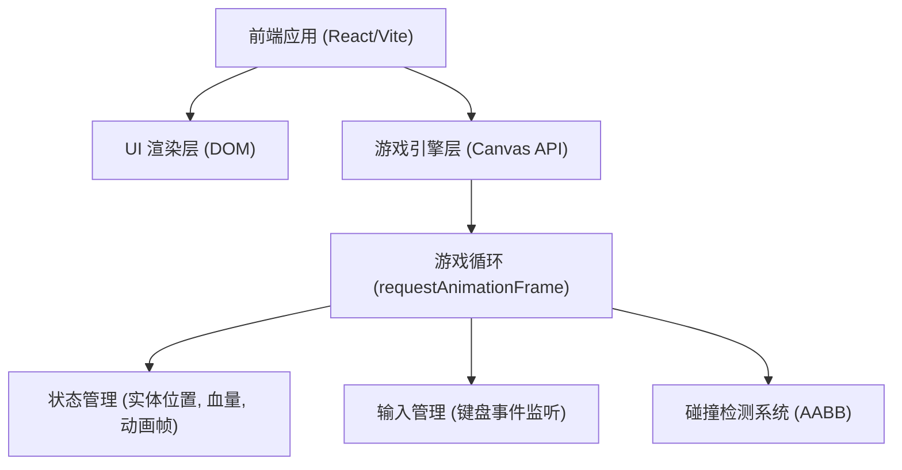

## 1. 架构设计


## 2. 技术描述
- **前端框架**: React@18 + TailwindCSS + Vite
- **游戏渲染**: HTML5 `<canvas>` 配合原生 JavaScript 2D Context。
- **状态管理**: 在 React 组件内部使用 `useRef` 保存可变的游戏状态（如玩家坐标、速度、血量、当前动作等），避免 React 状态更新导致频繁重渲染，保证 60FPS。
- **素材方案**: 为了形成一个独立可运行的 Demo，采用代码生成像素画（Pixel Art Generator）或基础几何图形拼接（通过 Canvas 绘制特定颜色的像素方块组合）来表现中式武侠人物与背景，无需外部依赖图片。

## 3. 路由定义
| 路由 | 用途 |
|-------|---------|
| / | 主游戏页面，包含游戏Canvas和说明文档 |

## 4. 游戏实体数据模型
```typescript
interface Player {
  position: { x: number; y: number };
  velocity: { x: number; y: number };
  width: number;
  height: number;
  health: number;
  maxHealth: number;
  color: string;
  isAttacking: boolean;
  isDefending: boolean;
  attackBox: {
    position: { x: number; y: number };
    width: number;
    height: number;
  };
  facingRight: boolean;
  state: 'idle' | 'run' | 'jump' | 'fall' | 'attack' | 'defend' | 'hit' | 'dead';
}
```
