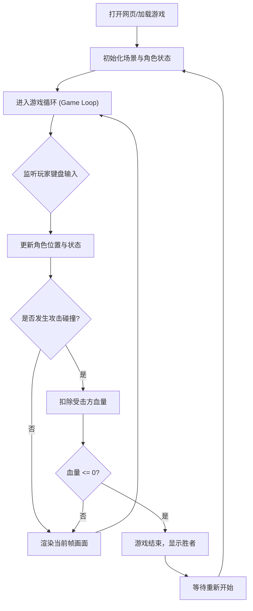

## 1. 产品概述
《像素武林》是一款复古像素风格的2D中式武侠对战小游戏。
- 核心目的是提供一个简单、有趣且视觉风格统一的网页端格斗Demo，玩家可以通过键盘操作两名武侠角色进行移动、攻击与防御，并决出胜负。

## 2. 核心功能

### 2.1 角色设计
| 角色 | 特点 | 武器 |
|------|------|------|
| 剑客 (Player 1) | 攻击范围广，身法灵动 | 长剑 |
| 拳师 (Player 2) | 攻击速度快，近战爆发 | 拳套/赤手空拳 |

### 2.2 功能模块
1. **游戏主界面**：包含背景场景、两名角色、生命值UI条、计时器或胜负提示。
2. **操作控制系统**：监听键盘事件，控制双方角色的移动、跳跃、攻击、防御。
3. **碰撞与战斗判定**：检测攻击框与受击框的重叠，扣除生命值。
4. **游戏循环机制**：帧更新、动画渲染、胜负结算。

### 2.3 页面详情
| 页面名称 | 模块名称 | 功能描述 |
|-----------|-------------|---------------------|
| 主游戏页 | 战斗UI | 显示双方血量条（HP）、回合时间、胜负结果（KO提示） |
| 主游戏页 | 场景渲染 | 渲染中式武侠风格的背景（如竹林、客栈外景），复古像素风 |
| 主游戏页 | 角色控制 | P1使用 WASD 移动，J 攻击，K 防御；P2使用 方向键 移动，1 攻击，2 防御 |

## 3. 核心流程
玩家打开网页 -> 游戏初始化（加载像素素材/绘制基础像素方块） -> 双方开始战斗 -> 判定攻击与掉血 -> 一方血量归零 -> 游戏结束并提示胜者 -> 刷新或按键重置游戏。

## 4. 用户界面设计
### 4.1 设计风格
- **主色调**：中式古典配色（竹青、黛蓝、朱红、玄黑）。
- **字体**：复古像素字体（如果浏览器不支持，则用加粗无衬线体模拟像素感）。
- **画面风格**：8-bit / 16-bit 像素艺术。由于是Demo，基础素材可以使用Canvas绘制的色块组合来模拟像素角色（头、身体、四肢、武器），或使用代码生成像素矩阵。
- **动画表现**：受击时的闪烁（白光/红光）、攻击时的残影或武器轨迹、跳跃时的抛物线。

### 4.2 页面设计概览
| 页面名称 | 模块名称 | UI元素 |
|-----------|-------------|-------------|
| 主游戏页 | 顶部信息栏 | 红色血量条带黄色底衬，中间显示大号KO或Timer字体 |
| 主游戏页 | 游戏视窗 | 宽比例(如 1024x576) 的Canvas，底层画竹林背景，中层画角色，顶层画特效 |

### 4.3 响应式
- 桌面端优先，为了保证操作体验，建议在PC浏览器上通过键盘游玩。移动端可后续考虑虚拟按键。
